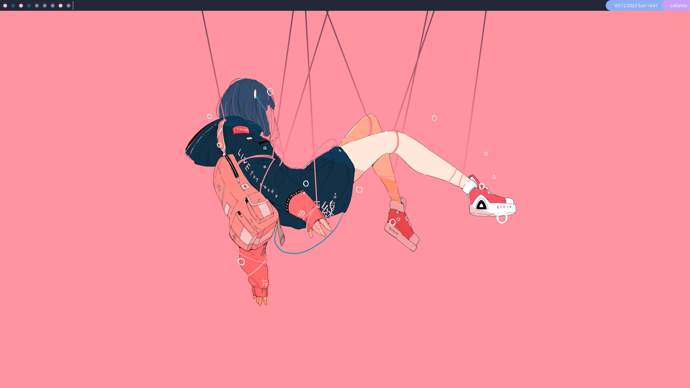

# qtile config
I'm taking a break from improving my qtile config, so this config may not be in its peak of functionality, although I've been using it in the current state for some time. 




# installation 
## prerequisites
- [qtile](https://qtile.org/) 
- [qtile-extras](https://github.com/elParaguayo/qtile-extras) - for some additional decorations 
- [psutil](https://github.com/giampaolo/psutil) - to check if device has a battery 
- [wallpaper](../wallpapers/wired.jpg) - although you can just change path to some other wallpaper in this config 
- [vscode-codicons](https://github.com/microsoft/vscode-codicons) - for these dots on the bar representing groups  

## creating symbolic link
change the name of your current config if you want to keep it
```shell
mv ~/.config/qtile/config.py ~/.config/qtile/_config.py
```
or just delete it (I wouldn't do that, tho)
```shell
rm -rf ~/.config/qtile/config.py 
```
create a symbolic link to your file in dotfiles repo 
```shell
ln -s ~/dotfiles/qtile/config.py ~/.config/qtile/config.py
```

## copying  
change the name of your current config if you want to keep it
```shell
mv ~/.config/qtile/config.py ~/.config/qtile/new_name.py
```
copy config.py
```shell
cp ~/dotfiles/qtile/config.py ~/.config/qtile/config.py
```