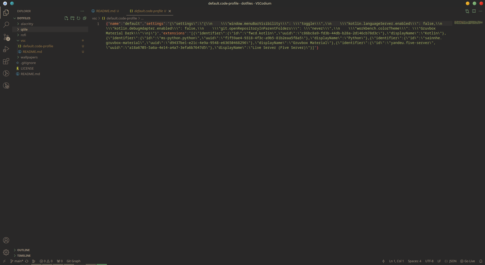

# vscode/vscodium config 
Config for my vscodium. For now it is really basic, but I want to slowly customize it.   

# installation 
## prerequisites 
- [vscode](https://code.visualstudio.com/)   
**OR**
- [vscodium](https://vscodium.com/) which I use, because it's FOSS  

## import profile 
1. open vsc 
2. press    
    `Ctrl`  + `Shift` + `p` on Linux and Windows   
    `Command` + `Shift` + `p` on macOS
3. type *import profile* 
4. select `default.code-profile`
5. select settings you want to import
6. confirm 